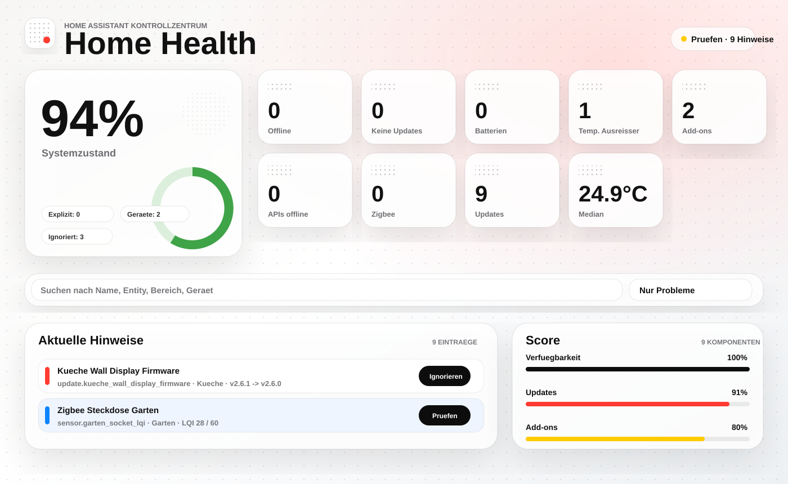
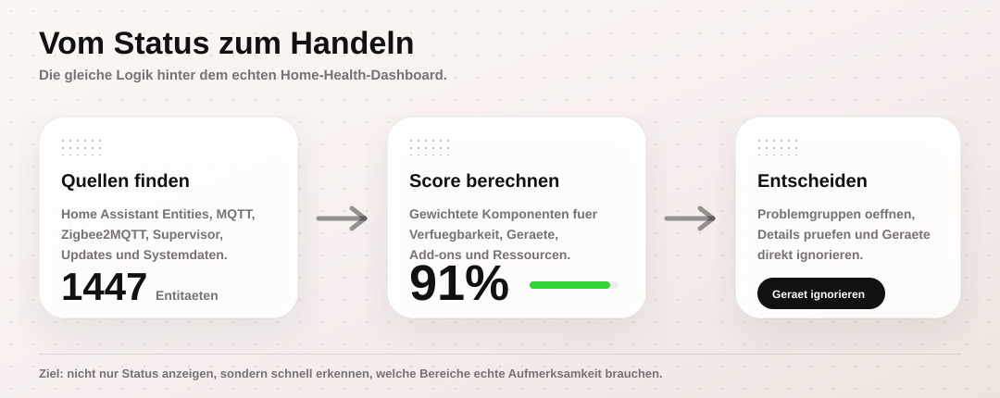

# Home Health Overview

Eine HACS-installierbare Home-Assistant-Integration, die den Zustand deines Smart Homes in einem kompakten Health Dashboard zusammenfasst.

Home Health Overview erkennt problematische Entitäten, schwache Batterien, veraltete Sensorwerte, API-/Bridge-Probleme, Zigbee-Signalqualität und Systemressourcen. Zusätzlich liefert die Integration einen gewichteten Health Score und ein eigenes Sidebar-Panel mit Suche, Filtern und direkten Aktionen.



## Highlights

- Moderner `Home Health` Sidebar-Bereich im Neo-Bauhaus-Stil
- Gewichteter Home Health Score von 0 bis 100
- Erkennung von `offline`- und `unknown`-Entitäten
- Warnungen für niedrige und kritische Batteriestände
- Erkennung von Entitäten ohne aktuelle Updates
- Temperatur-Median, Mittelwert und Ausreißer
- API-, Add-on- und Bridge-Watchlists
- Zigbee2MQTT-/MQTT-Erkennung und schwache Linkquality
- CPU-, RAM- und Speicherüberwachung
- Konfigurierbare Ignore-Listen, Prefix-Filter und explizite Watchlists
- Lovelace-YAML-Dashboard als Alternative oder Ergänzung

## Installation über HACS

1. Öffne HACS in Home Assistant.
2. Gehe zu `Integrationen`.
3. Öffne das Menü oben rechts und wähle `Benutzerdefinierte Repositories`.
4. Füge dieses Repository hinzu:

   ```text
   https://github.com/SebasJPS/HA_Overview
   ```

5. Wähle als Kategorie `Integration`.
6. Installiere `Home Health Overview`.
7. Starte Home Assistant neu.
8. Öffne `Einstellungen -> Geräte & Dienste -> Integration hinzufügen`.
9. Suche nach `Home Health Overview` und füge die Integration hinzu.

Nach der Einrichtung erscheint links in Home Assistant das Sidebar-Panel `Home Health`.

## Nutzung

Das Sidebar-Panel ist der zentrale Einstiegspunkt. Es zeigt:

- den aktuellen Systemzustand als Score
- alle wichtigen Problemzähler als KPI-Kacheln
- Score-Komponenten und gefundene Datenquellen
- betroffene Entitäten als durchsuchbare und filterbare Tabellen
- direkte Aktionen zum `Ignorieren` oder `Überwachen` einzelner Entitäten

Betroffene Entitäten können im Panel angeklickt werden, um die Home-Assistant-Detailansicht zu öffnen.



## Wichtige Sensoren

Die Integration legt unter anderem diese Entitäten an:

```text
sensor.home_health_overview_health_score
sensor.home_health_overview_offline_entities
sensor.home_health_overview_stale_entities
sensor.home_health_overview_low_batteries
sensor.home_health_overview_critical_batteries
sensor.home_health_overview_temperature_median
sensor.home_health_overview_temperature_average
sensor.home_health_overview_temperature_outliers
sensor.home_health_overview_apis_offline
sensor.home_health_overview_zigbee_linkquality_low
sensor.home_health_overview_addon_problems
sensor.home_health_overview_system_resource_problems
binary_sensor.home_health_overview_critical
binary_sensor.home_health_overview_warning
```

Die Zähler-Sensoren enthalten ein Attribut `details`. Darin stehen die betroffenen Einträge mit Name, Entity-ID, Bereich, Gerät, Status und weiteren Kontextdaten wie letztem Update, Batteriewert, Temperaturabweichung oder Linkquality.

## Health Score

Der Home Health Score bewertet den Gesamtzustand proportional über mehrere Bereiche:

- Verfügbarkeit überwachter Entitäten
- Aktualität von Sensorwerten
- Batteriezustand
- Temperatur-Ausreißer
- API-, Add-on- und Bridge-Verfügbarkeit
- Zigbee-Linkquality
- Systemressourcen wie CPU, RAM und Speicher

Eine einzelne Offline-Entität senkt den Score nur anteilig zum Gesamtbestand. Dadurch bleibt der Score auch in größeren Installationen aussagekräftig und springt nicht wegen eines einzelnen Geräts sofort auf kritisch.

Das Mockup oben zeigt die gedachte Logik: Home Assistant liefert Rohzustände, die Integration gruppiert und bewertet sie, und das Panel macht daraus konkrete Handlungslisten.

## Konfiguration

Die Optionen findest du in Home Assistant unter:

```text
Einstellungen -> Geräte & Dienste -> Home Health Overview -> Konfigurieren
```

Dort kannst du:

- Entitäten explizit überwachen
- Entitäten ignorieren
- Prefixe ausblenden
- API-, Add-on- und Bridge-Watchlists pflegen
- Schwellenwerte und Quellen passend zu deinem Setup setzen

Die Optionen nutzen Home-Assistant-Entity-Selectoren, damit Watchlists und Ignore-Listen ohne manuelle Entity-ID-Pflege gesetzt werden können.

## Lovelace-Dashboard

Zusätzlich zum Sidebar-Panel liegt ein YAML-Dashboard bei:

```text
dashboards/home-health-dashboard.yaml
```

Es enthält Seiten für Übersicht, Sensoren, Batterien, Klima, Energie, Integrationen und Wartung. Die ältere YAML-Paket-Variante bleibt als Alternative erhalten:

```text
packages/home_health.yaml
```

Details zum manuellen Live-Stellen stehen in [docs/LIVE_STELLEN.md](docs/LIVE_STELLEN.md).

## Projektdateien

- [custom_components/home_health_overview](custom_components/home_health_overview) enthält die HACS-Integration.
- [custom_components/home_health_overview/frontend/panel.js](custom_components/home_health_overview/frontend/panel.js) enthält das Sidebar-Panel.
- [dashboards/home-health-dashboard.yaml](dashboards/home-health-dashboard.yaml) enthält das optionale Lovelace-Dashboard.
- [packages/home_health.yaml](packages/home_health.yaml) enthält die alternative YAML-Paketvariante.
- [docs/HACS_INSTALL.md](docs/HACS_INSTALL.md) beschreibt die HACS-Installation.
- [docs/GITHUB_DEPLOY.md](docs/GITHUB_DEPLOY.md) beschreibt Deployment über GitHub.
- [docs/RELEASE_PROCESS.md](docs/RELEASE_PROCESS.md) beschreibt Releases und Tags.

## Releases

Dieses Repository nutzt GitHub Actions für Validierung und Releases. Der Release-Prozess ist:

1. Version in `custom_components/home_health_overview/manifest.json` erhöhen.
2. Änderung nach `main` committen und pushen.
3. Passenden Tag erstellen, zum Beispiel `v0.7.1`.
4. Tag pushen.

Der Release-Workflow prüft, ob Tag und Manifest-Version zusammenpassen.

## Status

Aktuelle Version: `0.7.2`
