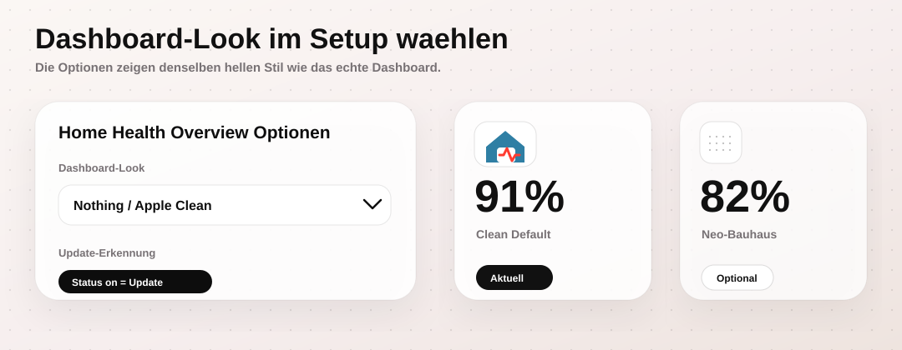

# Home Health Overview

Eine HACS-installierbare Home-Assistant-Integration, die den Zustand deines Smart Homes in einem kompakten Health Dashboard zusammenfasst.

A HACS-installable Home Assistant integration that summarizes your smart home health in one compact dashboard.


## Highlights

- Health Score von 0 bis 100 / health score from 0 to 100
- Problemzähler für Offline-Entitäten, veraltete Werte, Batterien, Updates, APIs, Zigbee, Add-ons und Systemressourcen
- Sidebar-Panel `Home Health` mit Filtern, Score-Komponenten, Datenquellen und direkten Aktionen
- Umschaltbarer Look: `Nothing / Apple Clean` als Standard oder `Neo-Bauhaus Klassisch`
- Konfigurierbare Ignore-Listen, Geräte-Ignore, Prefix-Filter und explizite Watchlists
- Optionales Lovelace-YAML-Dashboard zusätzlich zum Sidebar-Panel

## Installation

1. Öffne HACS in Home Assistant.
2. Gehe zu `Integrationen`.
3. Öffne das Menü oben rechts und wähle `Benutzerdefinierte Repositories`.
4. Füge dieses Repository hinzu:

   ```text
   https://github.com/SebasJPS/HA_Overview
   ```

5. Wähle als Kategorie `Integration`.
6. Installiere `Home Health Overview`.
7. Starte Home Assistant neu.
8. Öffne `Einstellungen -> Geräte & Dienste -> Integration hinzufügen`.
9. Suche nach `Home Health Overview` und füge die Integration hinzu.

English: In HACS, add this repository as an `Integration`, install `Home Health Overview`, restart Home Assistant, then add the integration under `Settings -> Devices & services`.

## Nutzung / Usage

Nach der Einrichtung erscheint links in Home Assistant das Sidebar-Panel `Home Health`.

Das Panel zeigt den aktuellen Systemzustand als Score, wichtige Problemzähler als KPI-Kacheln, Score-Komponenten, erkannte Datenquellen und betroffene Entitäten als gefilterte Tabellen. Einzelne Entitäten können direkt ignoriert oder explizit überwacht werden. Betroffene Entitäten öffnen per Klick die Home-Assistant-Detailansicht.

The panel shows the current health score, problem counters, score components, detected data sources, and affected entities in filtered tables. Affected entities can be opened in Home Assistant, ignored, or explicitly monitored.


## Dashboard-Look

Die Optionen findest du unter:

```text
Einstellungen -> Geräte & Dienste -> Home Health Overview -> Konfigurieren
```

Unter `Dashboard-Look` kannst du wählen:

- `Nothing / Apple Clean`: neuer Standard mit hellen, ruhigen Karten und Dot-Matrix-Akzenten
- `Neo-Bauhaus Klassisch`: bisheriger kontrastreicher Look mit Raster, harten Linien und Bauhaus-Akzenten

English: Configure the dashboard look under `Settings -> Devices & services -> Home Health Overview -> Configure`.



## Konfiguration / Configuration

In den Optionen kannst du:

- Entitäten immer überwachen
- Entitäten, Geräte oder Prefixe ignorieren
- API-, Add-on-, Bridge- und Systemressourcen-Watchlists pflegen
- Schwellenwerte für Batterien, veraltete Updates, Temperaturausreißer, Zigbee-Linkquality, CPU, RAM und Speicher anpassen

## Wichtige Sensoren / Important Sensors

```text
sensor.home_health_overview_health_score
sensor.home_health_overview_offline_entities
sensor.home_health_overview_stale_entities
sensor.home_health_overview_low_batteries
sensor.home_health_overview_critical_batteries
sensor.home_health_overview_temperature_median
sensor.home_health_overview_temperature_average
sensor.home_health_overview_temperature_outliers
sensor.home_health_overview_apis_offline
sensor.home_health_overview_zigbee_linkquality_low
sensor.home_health_overview_addon_problems
sensor.home_health_overview_system_resource_problems
sensor.home_health_overview_updates_available
sensor.home_health_overview_problem_devices
binary_sensor.home_health_overview_critical
binary_sensor.home_health_overview_warning
```

Die Zähler-Sensoren enthalten ein Attribut `details` mit Name, Entity-ID, Bereich, Gerät, Status und weiteren Kontextdaten wie letztem Update, Batteriewert, Temperaturabweichung, Linkquality oder installierter und verfügbarer Update-Version.

Counter sensors include a `details` attribute with affected entries and context such as last update, battery value, temperature delta, linkquality, or installed/latest update versions.

## Lovelace Dashboard

Zusätzlich zum Sidebar-Panel liegt ein YAML-Dashboard bei:

```text
dashboards/home-health-dashboard.yaml
```

Die ältere YAML-Paket-Variante bleibt als Alternative erhalten:

```text
packages/home_health.yaml
```

## Projektdateien / Project Files

- [custom_components/home_health_overview](custom_components/home_health_overview) contains the HACS integration.
- [custom_components/home_health_overview/frontend/panel.js](custom_components/home_health_overview/frontend/panel.js) contains the sidebar panel.
- [dashboards/home-health-dashboard.yaml](dashboards/home-health-dashboard.yaml) contains the optional Lovelace dashboard.
- [packages/home_health.yaml](packages/home_health.yaml) contains the alternative YAML package.
- [docs/HACS_INSTALL.md](docs/HACS_INSTALL.md) describes HACS installation.
- [docs/GITHUB_DEPLOY.md](docs/GITHUB_DEPLOY.md) describes GitHub deployment.
- [docs/RELEASE_PROCESS.md](docs/RELEASE_PROCESS.md) describes releases and tags.

## Releases

Dieses Repository nutzt GitHub Actions für Validierung und Releases.

1. Version in `custom_components/home_health_overview/manifest.json` erhöhen.
2. Änderung nach `main` committen und pushen.
3. Der Release-Workflow erstellt den passenden Tag und GitHub Release aus der Manifest-Version.

Der Release-Workflow prüft, ob Tag und Manifest-Version zusammenpassen.

## Support

Home Health Overview ist kostenlos und bleibt kostenlos.

Home Health Overview is free and will remain free.

[Buy me a coffee](https://buymeacoffee.com/sebasbe)

## Status

Aktuelle Version / Current version: `0.8.5`
